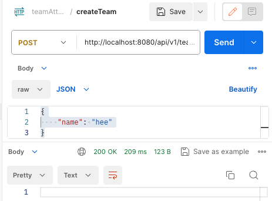

# 미니프로젝트 결과

## 결과 요약

### 프로젝트 1단계

모두 구현했다. `Team-Member` OneToMany연관관계와, `Team.manager-member` OneToOne연관관계를 이용해 해결했다.

도메인에서 role변경 로직을 적용하고 싶어 OneToOne연관관계를 추가했는데, 연관관계가 복잡해진 것 같다.

### 프로젝트 2단계

모두 구현했다. 출근 날짜를 기준으로 한 `Attendance` Entity와 출근 시간을 기준으로한 `AttendanceTime` Entity를 OneToMany연관관계를 이용해 해결했다.

POST시 당일 근무 시간을 누적했다.

```
추가 구현 사항
- (O) 등록되지 않은 직원 출근
- (O) 출근한 직원 다시 출근
    - 이전 출근은 무시된다.
- (O) 퇴근하려는 직원이 출근하지 않은 경우
    - 자정을 넘어 야근 한 것으로 간주해 0시 부터 시간을 누적한다.
- (O) 그날 출근했다 퇴근한 직원이 다시 출근
    - 정상적으로 시간이 누적된다.
```

### 프로젝트 3단계

연차 조회기능을 제외하고 구현했다. Team에 연차 제한 거리를 저장하고 계산했다. 연차를 등록하고 검색할 수 있게 제작했다.

TODO: 스케줄링을 통해 1월 1일에 직원의 연차를 15개로 늘려준다.

TODO: 연차 조회

### 프로젝트 4단계

배포를 했지만, h2 create로 사용하고 도메인을 변경하지 않고 사용했다.

# 구현한 API

## 1. 팀 등록기능

```json
POST /api/v1/team HTTP/1.1
Host: localhost:8080
Content-Type: application/json
Content-Length: 21

{
    "name": "hee"
}
```



## 2. 팀 전체 조회

```json
GET /api/v1/team HTTP/1.1
Host: localhost:8080
```


## 3. 팀이름 변경(요구 사항 외)

```json
PUT /api/v1/team HTTP/1.1
Host: localhost:8080
Content-Type: application/json
Content-Length: 47

{
    "oldName": "hee",
    "newName": "hee2"
}
```

## 4. 맴버 등록

맴버를 등록할 수 있다. role = “MAMAGER”일 경우 기존 팀의 매니저를 대치시킨다.

```json
POST /api/v1/member HTTP/1.1
Host: localhost:8080
Content-Type: application/json
Content-Length: 135

{
    "teamName": "hee",
    "name": "heisje3",
    "role": "MANAGER",
    "birthday": "1989-01-01",
    "workStartDate":"2024-01-01"
}
```


## 5. 맴버 조회

```xml
GET /api/v1/member HTTP/1.1
Host: localhost:8080
```


## 6. 출근 기록 생성

`isGoToWork` 로 출근인지 퇴근인지 파악한 후, 해당 날짜의 근무 시간을 누적시킨다.

야근시 0시 이후 퇴근이 존재할 수 있다고 생각해 퇴근이 먼저 올 경우도 시간을 누적시킬 수 있다.

다만 전날 24시에 무조건 퇴근을 찍어야 하게 구성되어있다.

해결방법 = 출근으로 끝나는 날짜가 ‘지난날’이면 시간을 누적하게 만든다. and 어제 출근으로 끝이 났으면, 스케줄링을 통해 퇴근 안한 것으로 처리하고 근무시간을 누적한다.

라고 생각했지만, 로직이 복잡해져 더 쉬운방법이 없을까 고민하고 있다.

```xml
POST /api/v1/attendance HTTP/1.1
Host: localhost:8080
Content-Type: application/json
Content-Length: 81

{
    "memberId": 1,
    "time": "2024-02-21T15:30:00",
    "isGoToWork": false
}
```

## 7. 출근 기록 검색

문제와 다르게 `usingDayOff`와 `dayOff`를 구분했다. 왜냐면 `dayOff`를 등록한 것도 찾고 싶었고, `usingDayOff`를 한 것도 찾고싶었다.

`sum`은 post시에 구해놨던 workingMinutes를 모두 더한다.

`usingDayOff`는 스케줄링으로 날짜가 지난 것을 일괄 변경한 것을 참조한다.

```xml
GET /api/v1/attendance?memberId=1&date=2024-03-01 HTTP/1.1
Host: localhost:8080
```


## 8. 휴가 작성

휴가를 작성한다. 팀내에 휴가 허용 범위(`Integer dayOffAllowedDuration`)을 두고 체크한다.

```xml
PUT /api/v1/attendance/day-off HTTP/1.1
Host: localhost:8080
Content-Type: application/json
Content-Length: 69

{
    "memberId": 1,
    "date": "2024-03-07",
    "isDayOff": true
}
```


## 9. TODO: 초과 근무 검색

초과 근무 시간은 아직 구현하지 못했다.

```xml
GET /api/v1/member/overtime?date=2024-03-01 HTTP/1.1
Host: localhost:8080
```


